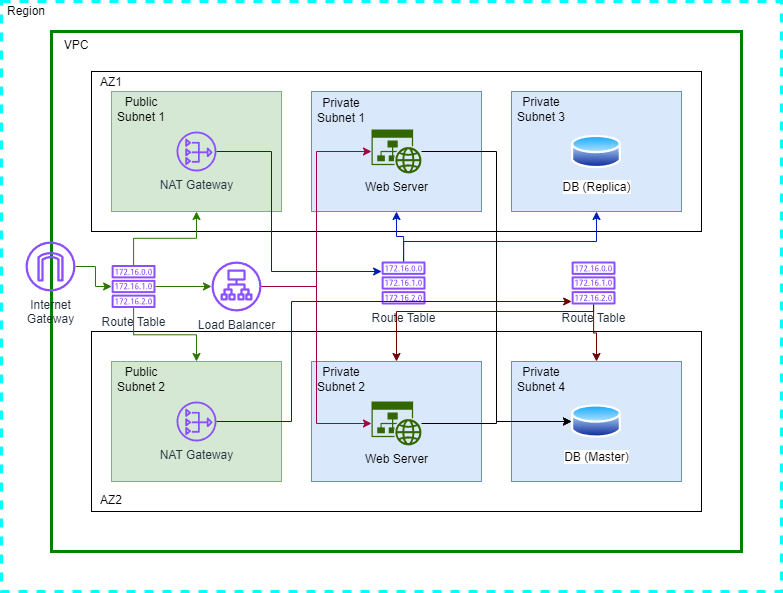
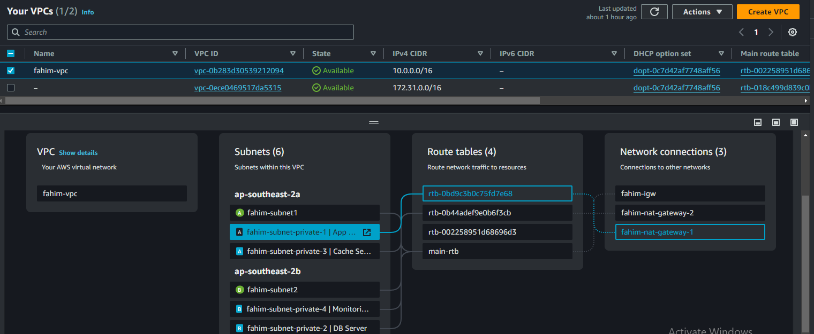

# CloudCraft: Scalable Web Infrastructure on AWS

## Project Overview

CloudCraft is a robust, scalable web infrastructure project designed to deploy and manage a high-availability web application on Amazon Web Services (AWS). This project utilizes Infrastructure as Code (IaC) principles with Terraform to create a secure, efficient, and easily maintainable cloud environment.

## Infrastructure Diagram

This diagram illustrates the high-level architecture of the CloudCraft infrastructure, showcasing the VPC, public and private subnets, security groups, and key components.

## Component Interaction

This diagram demonstrates how the various components of the CloudCraft infrastructure interact with each other, including traffic flow and security group relationships.

## Architecture

The CloudCraft infrastructure consists of the following key components:

1. **Virtual Private Cloud (VPC)**
   - Custom VPC with a specified CIDR block
   - Internet Gateway for public internet access
   - Route Table for network traffic management

2. **Subnets**
   - 2 Public Subnets (in different Availability Zones)
   - 4 Private Subnets (in different Availability Zones):
     - App Server Subnet
     - Database Server Subnet
     - Cache Server Subnet
     - Monitoring Server Subnet

3. **Security Groups**
   - Application Load Balancer Security Group
   - Web Server Security Group
   - Database Security Group

4. **Load Balancer**
   - Application Load Balancer for distributing incoming traffic

5. **Compute Resources**
   - EC2 instances for web servers (not explicitly shown in the provided code)

6. **Database**
   - RDS instance for the database (not explicitly shown in the provided code)

## Network Configuration

- VPC CIDR: Defined in variables (var.vpc_cidr)
- Public Subnet CIDRs: var.public_subnet_cidr1, var.public_subnet_cidr2
- Private Subnet CIDRs: var.private_subnet_cidr1, var.private_subnet_cidr2, var.private_subnet_cidr3, var.private_subnet_cidr4

## Security

Security Groups are configured to control inbound and outbound traffic:

- ALB Security Group: Allows inbound traffic on ports 80 and 443
- Web Server Security Group: Allows inbound traffic on ports 80, 443, and 22 (SSH)
- Database Security Group: Allows MySQL traffic (port 3306) only from the Web Server Security Group

## Deployment

To deploy this infrastructure:

1. Ensure you have Terraform installed and configured with your AWS credentials.
2. Clone the repository containing these Terraform configurations.
3. Navigate to the project directory.
4. Run `terraform init` to initialize the Terraform working directory.
5. Run `terraform plan` to see the execution plan.
6. Run `terraform apply` to create the infrastructure.

## Best Practices

- Use of separate subnets for different components enhances security and network isolation.
- Multi-AZ deployment ensures high availability and fault tolerance.
- Security groups are tightly configured to follow the principle of least privilege.
- Infrastructure as Code allows for version control and easy replication of the environment.

## Future Enhancements

- Implement auto-scaling for EC2 instances
- Add a bastion host for secure SSH access to private instances
- Implement a NAT Gateway for outbound internet access from private subnets
- Set up CloudWatch for monitoring and alerting

## Conclusion

CloudCraft provides a solid foundation for deploying scalable and secure web applications on AWS. By leveraging Terraform and following AWS best practices, this infrastructure can be easily managed, updated, and replicated across different environments.
